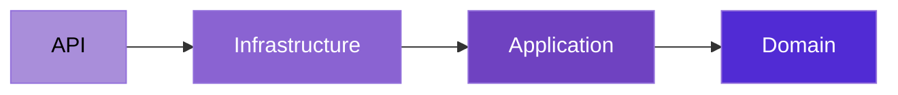
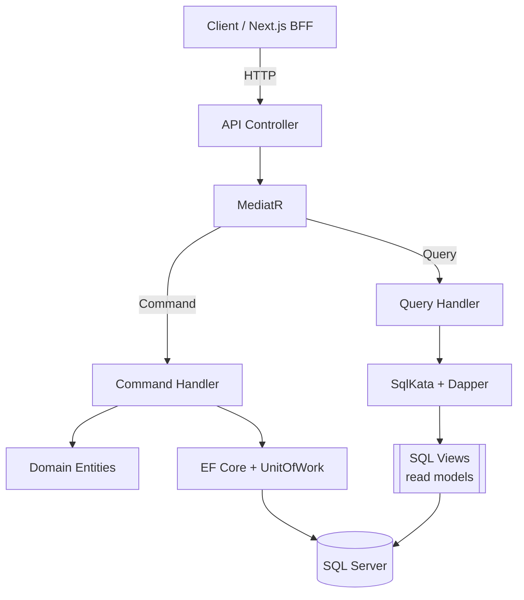

# MyOS

> **A personal life operating system** — a production-grade modular monolith for managing notes, files, fitness, and more.

**English** · [Polski](./README.pl.md)


---

## About

**MyOS** is a self-hosted "operating system" for personal life domains — a single place to keep
your **notes**, **files**, **workouts**, and (soon) **learning** and **finance** data. It is a
full-stack application: an ASP.NET Core (.NET 10) backend and a Next.js 16 frontend.

> 💡 The complete architectural reference (conventions, layer rules, decisions) lives in
> [`CLAUDE.md`](./CLAUDE.md) at the repository root.

---

## Tech Stack

| Area | Technologies |
|---|---|
| **Backend** | .NET 10, ASP.NET Core Web API, MediatR (CQRS), EF Core (writes), SqlKata + Dapper (reads), FluentValidation, FluentMigrator, Serilog |
| **Frontend** | Next.js 16, React 19, TypeScript (strict), Tailwind CSS v4, shadcn/ui, TanStack Query, React Hook Form + Zod, next-intl |
| **Database** | SQL Server 2022 (one schema per module), SQL Views as read models |
| **Auth** | JWT access + refresh tokens, BCrypt (work factor 12), BFF pattern (httpOnly cookies) |
| **Infrastructure** | Docker Compose, Seq (structured log viewer), Swagger / OpenAPI (per module) |
| **Testing** | xUnit (translation completeness & convention tests); integration tests (Testcontainers) planned |

---

## Architecture

MyOS is a **modular monolith**: a single deployable backend split into independent bounded
contexts (modules). Each module is its own DDD slice with a `Domain` / `Application` /
`Infrastructure` triplet, its own database schema, and its own migrations. Modules communicate
only through public contracts — no tight coupling.

Every module follows **Clean Architecture** layering, with dependencies pointing inward:



**CQRS** strictly separates writes from reads — they even use different data-access stacks:



### Key design decisions

- **Modular monolith** — module isolation and schema-per-module discipline, with a clear path to
  extract a service later, without paying microservice tax now.
- **CQRS with separate read/write stacks** — commands go through EF Core + domain entities +
  `UnitOfWork` (one `SaveChanges` per handler); queries bypass EF entirely and read from SQL
  views via SqlKata, returning projection DTOs.
- **Result pattern** — predictable business errors flow as `Result<T>` values (mapped to the
  right HTTP status), not exceptions. Exceptions are reserved for genuine system failures.
- **Internationalisation (en/pl)** — error codes carry no message; messages are resolved from
  per-module `.resx` resources at the API boundary using the caller's language (JWT claim).
  Unit tests enforce that every error code has a translation in every language.
- **Polymorphic domain via TPH** — e.g. Fitness exercises (`Cardio` / `Strength`) use EF Core
  Table-Per-Hierarchy with an enum discriminator, surfaced through `oneOf` polymorphic Swagger
  schemas and System.Text.Json polymorphic request bodies.
- **BFF auth** — the frontend never sees raw JWTs; tokens live in httpOnly cookies and a Next.js
  proxy injects the `Authorization` header server-side.

---

## Modules

| Module | Description | Status |
|---|---|---|
| **Identity** | Registration, login, JWT + refresh tokens, language switching | ✅ Implemented |
| **Notes** | Text notes and checklists (with reorderable items) | ✅ Implemented |
| **Storage** | A personal drive: folders, file upload (up to 1 GB), preview, per-user quota | ✅ Implemented |
| **Fitness** | Cardio & strength exercises, workouts, sets, targets, statistics | ✅ Implemented |
| **Learning** | Courses / study tracking | 🚧 Planned |
| **Finance** | Personal finance tracking | 🚧 Planned |

---

## Quick Start

### Prerequisites

- [Docker](https://www.docker.com/) and Docker Compose

### Run the full stack

```bash
# 1. Clone the repo
git clone <repo-url>
cd MyOS

# 2. Create your environment file
cp .env.example .env
```

Then edit `.env` and set, at minimum:

- `JwtSettings__SecretKey` — a random string of **at least 32 characters**
- `SA_PASSWORD` / `SEQ_ADMIN_PASSWORD` — strong passwords

```bash
# 3. Build and start everything (SQL Server, migrator, Seq, API, web)
docker compose up -d
```

The migrator runs database migrations and synchronises SQL views automatically before the API starts.

### Access points

| Service | URL |
|---|---|
| Web app | http://localhost:3000 |
| API (Swagger) | http://localhost:5042/swagger |
| Seq (logs) | http://localhost:5341 |

> Ports are configurable via `.env` (`WEB_PORT`, `API_PORT`, `SEQ_UI_PORT`, `SQL_PORT`).

### Local development (without Docker)

```bash
# Backend — from the repo root
dotnet run --project MyOS.API

# Frontend — from src/web
cd src/web
npm install
npm run dev
```

For local frontend dev, create `src/web/.env.local` with `NEXT_PUBLIC_API_URL` pointing at your
running API (see [`src/web/CLAUDE.md`](./src/web/CLAUDE.md)).

---

## Project Structure

```
MyOS/
├── MyOS.API/                          ← Web API entry point (controllers, Program.cs)
├── MyOS.Migrator/                     ← FluentMigrator migrations + SQL view sync
│
├── MyOS.Core.Domain/                  ← shared base entities, enums
├── MyOS.Core.Application/             ← CQRS contracts, Result, pagination, abstractions
├── MyOS.Core.Infrastructure/          ← EF Core, Serilog, DI, cross-cutting services
│
├── MyOS.Identity.{Domain,Application,Infrastructure}/
├── MyOS.Modules.Notes.{Domain,Application,Infrastructure}/
├── MyOS.Modules.Storage.{Domain,Application,Infrastructure}/
├── MyOS.Modules.Fitness.{Domain,Application,Infrastructure}/
│
├── MyOS.Tests/                        ← unit tests
│
├── src/web/                           ← Next.js frontend (BFF, module slices)
│
├── docker-compose.yml
└── CLAUDE.md                          ← full architecture reference
```

Each business module follows an **entity-slice** structure (one folder per entity across all
three layers). See [`CLAUDE.md`](./CLAUDE.md) for the complete conventions.

---

## Roadmap

- [ ] **Learning** module — study / course tracking
- [ ] **Finance** module — personal finance tracking
- [ ] **Integration tests** with Testcontainers (real SQL Server)

---

The full architectural context for the codebase is documented in [`CLAUDE.md`](./CLAUDE.md).
