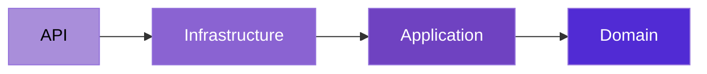
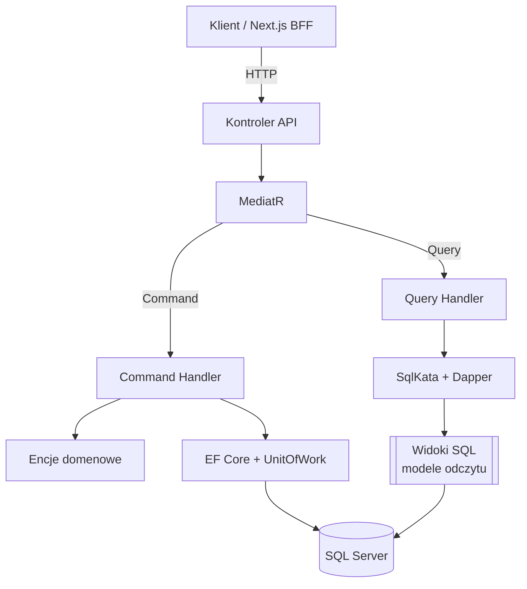

# MyOS

> **System operacyjny codziennego życia** — produkcyjnej jakości modular monolith do zarządzania notatkami, plikami, treningami i nie tylko.

[English](./README.md) · **Polski**


---

## O projekcie

**MyOS** to self-hostowany „system operacyjny” do zarządzania osobistymi obszarami życia —
jedno miejsce na **notatki**, **pliki**, **treningi** oraz (wkrótce) dane o **nauce** i
**finansach**. To aplikacja full-stack: backend w ASP.NET Core (.NET 10) i frontend w Next.js 16.

> 💡 Pełna dokumentacja architektury (konwencje, reguły warstw, decyzje) znajduje się w pliku
> [`CLAUDE.md`](./CLAUDE.md) w katalogu głównym repozytorium.

---

## Stos technologiczny

| Obszar | Technologie |
|---|---|
| **Backend** | .NET 10, ASP.NET Core Web API, MediatR (CQRS), EF Core (zapisy), SqlKata + Dapper (odczyty), FluentValidation, FluentMigrator, Serilog |
| **Frontend** | Next.js 16, React 19, TypeScript (strict), Tailwind CSS v4, shadcn/ui, TanStack Query, React Hook Form + Zod, next-intl |
| **Baza danych** | SQL Server 2022 (osobny schemat na moduł), widoki SQL jako modele odczytu |
| **Uwierzytelnianie** | JWT (access + refresh), BCrypt (work factor 12), wzorzec BFF (httpOnly cookies) |
| **Infrastruktura** | Docker Compose, Seq (przeglądarka logów strukturalnych), Swagger / OpenAPI (per moduł) |
| **Testy** | xUnit (testy kompletności tłumaczeń i konwencji); testy integracyjne (Testcontainers) — planowane |

---

## Architektura

MyOS to **modular monolith**: pojedynczy, wdrażalny backend podzielony na niezależne konteksty
(moduły). Każdy moduł to osobny wycinek DDD z trójką projektów `Domain` / `Application` /
`Infrastructure`, własnym schematem bazy i własnymi migracjami. Moduły komunikują się wyłącznie
przez publiczne kontrakty — bez ścisłego sprzężenia.

Każdy moduł stosuje warstwy **Clean Architecture**, z zależnościami skierowanymi do środka:



**CQRS** ściśle rozdziela zapisy od odczytów — korzystają nawet z różnych stosów dostępu do danych:



### Kluczowe decyzje projektowe

- **Modular monolith** — izolacja modułów i dyscyplina „schemat na moduł”, z gotową ścieżką do
  wydzielenia usługi w przyszłości, bez płacenia podatku od mikroserwisów już teraz.
- **CQRS z rozdzielonymi stosami odczyt/zapis** — komendy idą przez EF Core + encje domenowe +
  `UnitOfWork` (jeden `SaveChanges` na handler); zapytania całkowicie omijają EF i czytają z
  widoków SQL przez SqlKata, zwracając DTO projekcji.
- **Wzorzec Result** — przewidywalne błędy biznesowe płyną jako wartości `Result<T>` (mapowane na
  właściwy status HTTP), a nie wyjątki. Wyjątki rezerwowane są dla prawdziwych awarii systemowych.
- **Internacjonalizacja (en/pl)** — kody błędów nie niosą komunikatu; komunikaty rozwiązywane są
  z plików `.resx` per moduł na granicy API, w języku użytkownika (claim w JWT). Testy jednostkowe
  pilnują, że każdy kod błędu ma tłumaczenie w każdym języku.
- **Polimorficzna domena przez TPH** — np. ćwiczenia Fitness (`Cardio` / `Strength`) używają
  EF Core Table-Per-Hierarchy z dyskryminatorem typu enum, wystawione przez polimorficzne schematy
  `oneOf` w Swaggerze i polimorficzne body żądań w System.Text.Json.
- **Auth w modelu BFF** — frontend nigdy nie widzi surowych JWT; tokeny żyją w httpOnly cookies, a
  proxy Next.js wstrzykuje nagłówek `Authorization` po stronie serwera.

---

## Moduły

| Moduł | Opis | Status |
|---|---|---|
| **Identity** | Rejestracja, logowanie, JWT + refresh tokeny, zmiana języka | ✅ Gotowy |
| **Notes** | Notatki tekstowe i listy zadań (z możliwością zmiany kolejności pozycji) | ✅ Gotowy |
| **Storage** | Osobisty dysk: foldery, upload plików (do 1 GB), podgląd, limit (quota) na użytkownika | ✅ Gotowy |
| **Fitness** | Ćwiczenia cardio i siłowe, treningi, serie, cele, statystyki | ✅ Gotowy |
| **Learning** | Śledzenie nauki / kursów | 🚧 Planowany |
| **Finance** | Zarządzanie finansami osobistymi | 🚧 Planowany |

---

## Szybki start

### Wymagania

- [Docker](https://www.docker.com/) i Docker Compose

### Uruchomienie całego stacku

```bash
# 1. Sklonuj repozytorium
git clone <repo-url>
cd MyOS

# 2. Utwórz plik środowiskowy
cp .env.example .env
```

Następnie edytuj `.env` i ustaw co najmniej:

- `JwtSettings__SecretKey` — losowy ciąg o długości **min. 32 znaków**
- `SA_PASSWORD` / `SEQ_ADMIN_PASSWORD` — silne hasła

```bash
# 3. Zbuduj i uruchom wszystko (SQL Server, migrator, Seq, API, web)
docker compose up -d
```

Migrator automatycznie wykona migracje bazy i zsynchronizuje widoki SQL, zanim wystartuje API.

### Adresy

| Usługa | URL |
|---|---|
| Aplikacja web | http://localhost:3000 |
| API (Swagger) | http://localhost:5042/swagger |
| Seq (logi) | http://localhost:5341 |

> Porty można skonfigurować w `.env` (`WEB_PORT`, `API_PORT`, `SEQ_UI_PORT`, `SQL_PORT`).

### Praca lokalna (bez Dockera)

```bash
# Backend — z katalogu głównego repo
dotnet run --project MyOS.API

# Frontend — z src/web
cd src/web
npm install
npm run dev
```

Do lokalnego uruchomienia frontendu utwórz `src/web/.env.local` z `NEXT_PUBLIC_API_URL`
wskazującym na działające API (zob. [`src/web/CLAUDE.md`](./src/web/CLAUDE.md)).

---

## Struktura projektu

```
MyOS/
├── MyOS.API/                          ← punkt wejścia Web API (kontrolery, Program.cs)
├── MyOS.Migrator/                     ← migracje FluentMigrator + sync widoków SQL
│
├── MyOS.Core.Domain/                  ← współdzielone encje bazowe, enumy
├── MyOS.Core.Application/             ← kontrakty CQRS, Result, paginacja, abstrakcje
├── MyOS.Core.Infrastructure/          ← EF Core, Serilog, DI, usługi cross-cutting
│
├── MyOS.Identity.{Domain,Application,Infrastructure}/
├── MyOS.Modules.Notes.{Domain,Application,Infrastructure}/
├── MyOS.Modules.Storage.{Domain,Application,Infrastructure}/
├── MyOS.Modules.Fitness.{Domain,Application,Infrastructure}/
│
├── MyOS.Tests/                        ← testy jednostkowe
│
├── src/web/                           ← frontend Next.js (BFF, wycinki modułów)
│
├── docker-compose.yml
└── CLAUDE.md                          ← pełna dokumentacja architektury
```

Każdy moduł biznesowy ma strukturę **entity-slice** (jeden folder na encję we wszystkich trzech
warstwach). Pełne konwencje opisuje [`CLAUDE.md`](./CLAUDE.md).

---

## Roadmapa

- [ ] Moduł **Learning** — śledzenie nauki / kursów
- [ ] Moduł **Finance** — zarządzanie finansami osobistymi
- [ ] **Testy integracyjne** z Testcontainers (prawdziwy SQL Server)

---

Pełny kontekst architektoniczny kodu jest udokumentowany w [`CLAUDE.md`](./CLAUDE.md).
